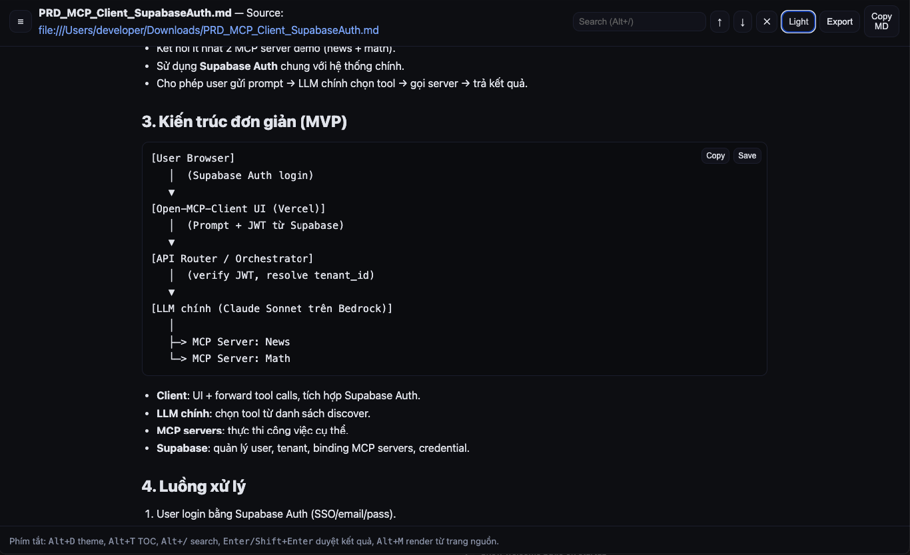
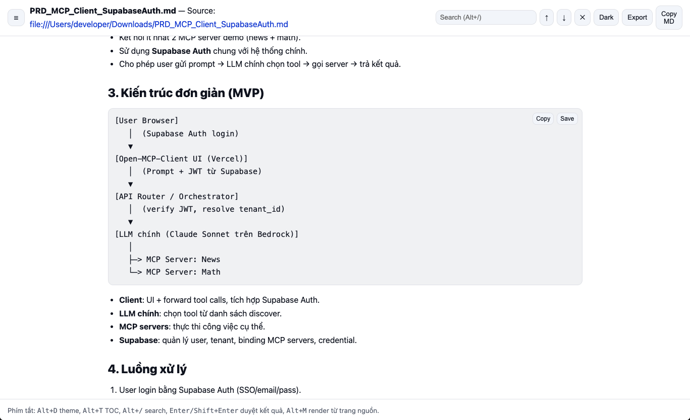
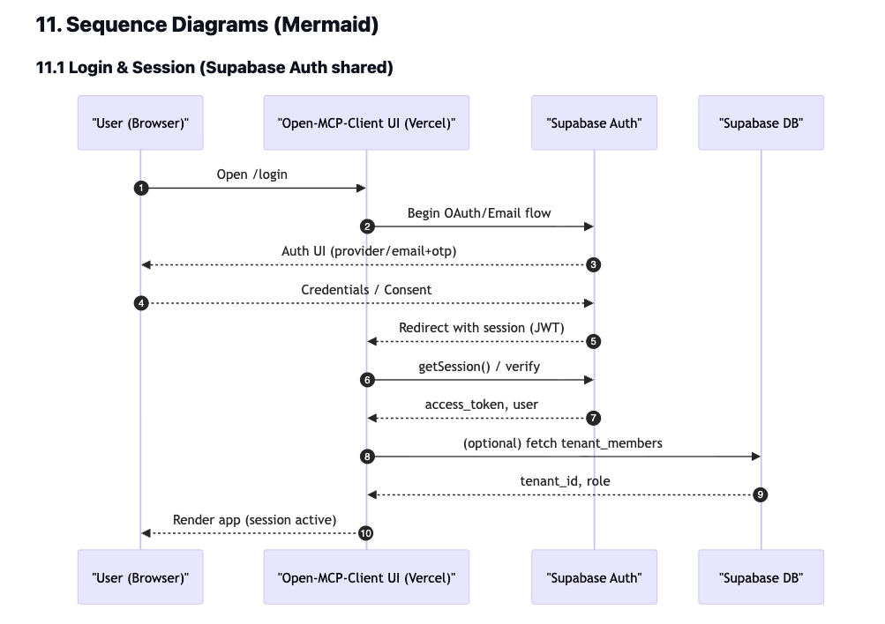
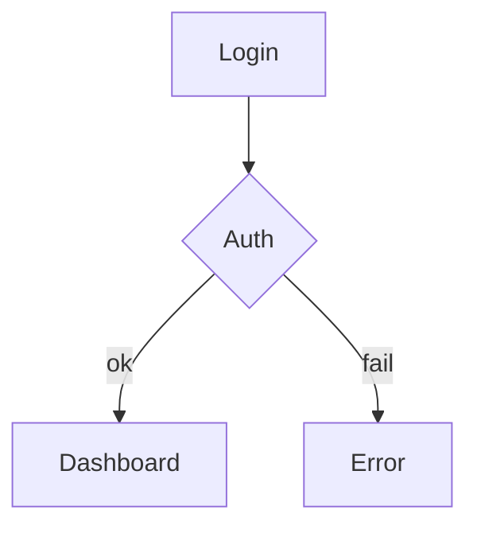

## MD Reader Pro

A fast, simple, offline Markdown reader for Chrome. It auto-detects `.md`/raw text pages and displays them nicely with a table of contents, page search, copy/save buttons on code blocks, standalone HTML export, dark/light themes, and Mermaid rendering.

### Screenshots
Place images in `docs/screenshots/` using the names below and they will render here.

| Dark theme | Light theme |
| --- | --- |
|  |  |

Additional examples:
- 

### Features
- **Auto reader view**: Detects Markdown-like or raw text pages. Press `Alt+M` to force.
- **Mermaid**: Supports fenced ```mermaid``` blocks and also auto-detects diagrams that start with keywords such as `graph`, `sequenceDiagram`, `classDiagram`, `stateDiagram` (incl. `-v2`), `erDiagram`, `journey`, `gantt`, `pie`, `gitGraph`, `mindmap`, `timeline`.
- **In-page search**: Type a query, use Enter/Shift+Enter to jump between matches.
- **TOC**: Generated from `#`..`######` headings.
- **Copy/Save code**: Buttons on every code block.
- **Export standalone HTML**: Package content + CSS into a single `.html` you can open anywhere.
- **Dark/Light theme**: Persisted across sessions.

### Install (Load unpacked)
1. Open `chrome://extensions/`.
2. Toggle Developer mode (top-right).
3. Click “Load unpacked” and select this project folder.
4. (Recommended) Enable “Allow access to file URLs” so local `file://` Markdown opens well.

### Usage
- **Automatic**: Open a `.md` or raw text page; the extension redirects to `reader.html` to display it.
- **Manual**: On any page that looks like raw Markdown/text, press `Alt+M` to render with the reader.
- **Direct link**: You can open `reader.html?src=<URL>` with any Markdown URL.

### Keyboard shortcuts
- **Alt+D**: Toggle Dark/Light theme
- **Alt+T**: Toggle TOC
- **Alt+/**: Focus the search box
- **Enter / Shift+Enter**: Next/previous search result
- **Alt+M**: Render from the current source page

### Writing Mermaid
You can use either form:

1) Fenced code block:


2) Plain blocks beginning with a Mermaid keyword (no triple backticks needed):
```
sequenceDiagram
  participant U as User
  participant API
  U->>API: POST /login
  API-->>U: 200 OK
```

The extension auto-detects these and, if the source text was HTML-encoded (e.g. `-&gt;`), it decodes before rendering to avoid Mermaid’s “Syntax error in text”.

### Export standalone HTML
- Click **Export** to save a self-contained `.html` including styles. Rendered Mermaid diagrams remain visible when opened elsewhere without the extension.

### Copy/Save code blocks
- Each code block has **Copy** (clipboard) and **Save** (download) buttons. The saved filename uses the block’s language when possible.

### Privacy
- All processing happens locally in your browser. The extension only `fetch`es the Markdown URL you open in order to display it. No data is sent elsewhere.

### Troubleshooting
- **Mermaid “Syntax error in text”**: Often caused by encoded arrows like `-&gt;`. This build decodes entities before rendering. If it still fails, re-check your Mermaid syntax.
- **No auto redirect to reader view**: Use `Alt+M`, or the page may not look like Markdown/raw text enough for detection.
- **Local files not loading**: Enable “Allow access to file URLs” for this extension on `chrome://extensions/`.
- **CORS/network blocks**: Some sites block cross-origin `fetch`. Download the `.md` and open via `file://` for a reliable experience.

### Project structure
- `content.js`: Detect Markdown/raw text pages and redirect to `reader.html`.
- `reader.html`: Main UI shell; loads CSS/JS and `vendor/mermaid.min.js`.
- `reader.js`: Minimal Markdown parsing, Mermaid rendering, TOC, search, copy/save, export, theme.
- `styles.css`: Styles.
- `vendor/mermaid.min.js`: Mermaid library (10.x).

### Development
- No build step. Edit files and click Reload on `chrome://extensions/`.
- See Mermaid render errors in the DevTools Console on `reader.html`.

### License
For internal use. Mermaid is owned by its respective project under its license.


